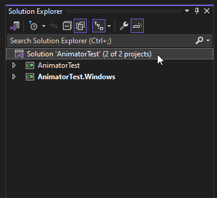
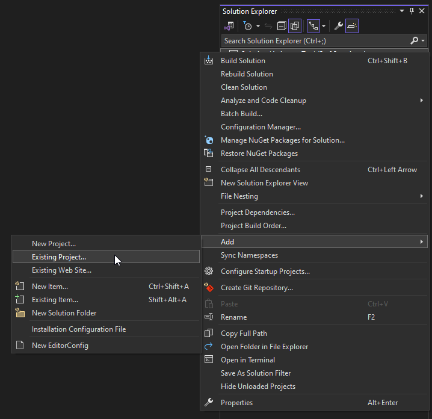
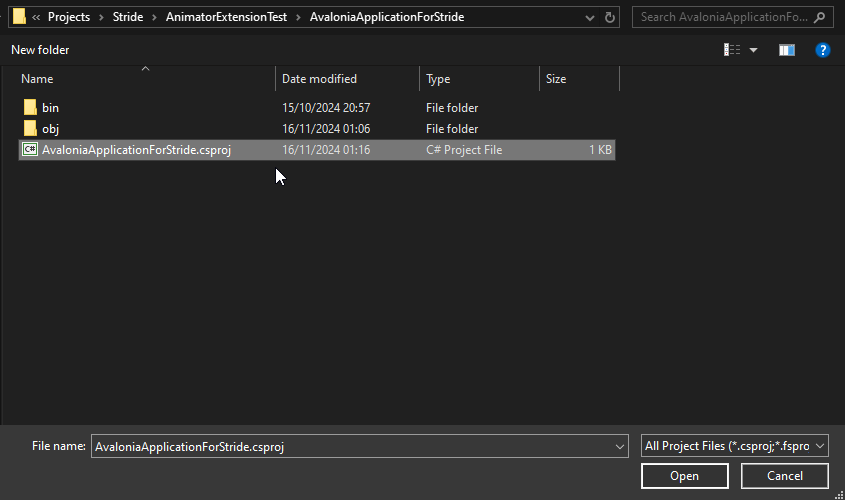
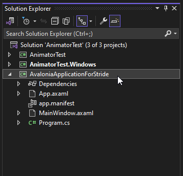
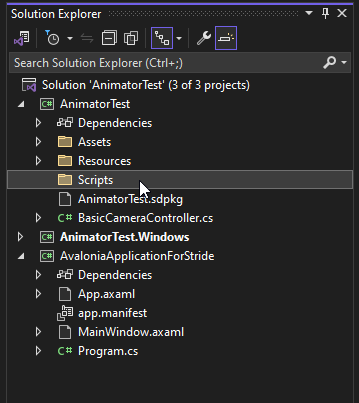
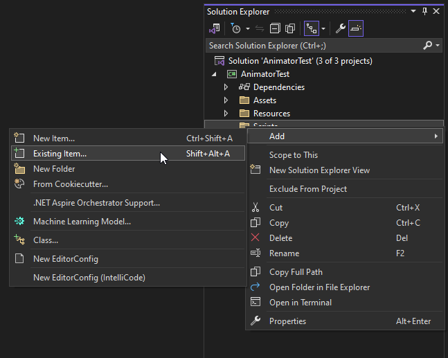
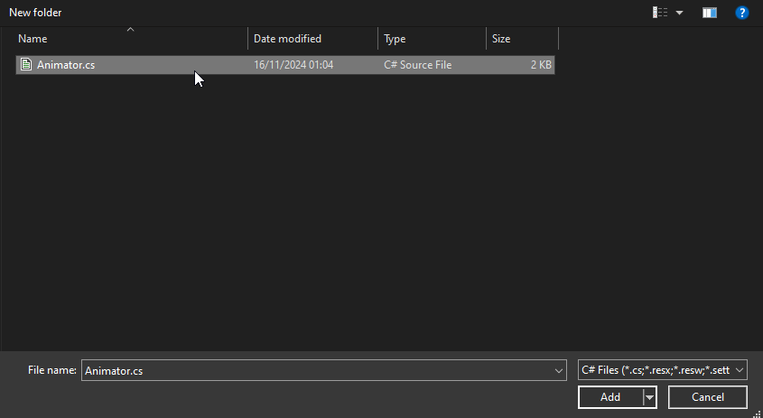
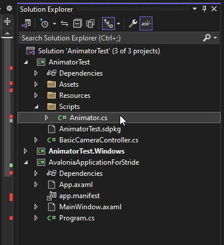
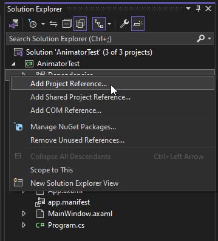
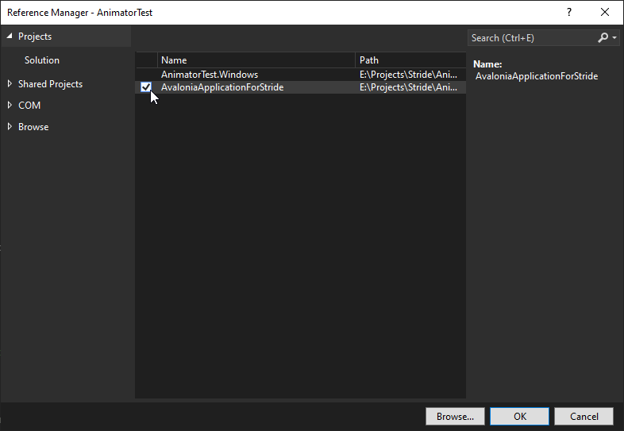

>[!CAUTION]
>The extension is at it's <b>earliest</b> stage of development and is not ready for use.

>[!NOTE]
>Huge thanks to
>- Damzic - for help with deep diving into Stride3D's API and some architectiral choices for the animator
>- Nicogo - for help with C# and Stride3D API for in-editor executable code

# Stride3D animator
An extensions for Stride3D game engine that provides easy to use powerful tools to create animations inside the engine.
# How to use it?
If you want to find out how to use the Stride3D animator, head to project's [Wiki](https://github.com/diwydiwydiwy/Stride3D-animator/tree/main/wiki) 
# Installation
## 1. Adding necessary .dll files to the Stride editor itself
For the first step, you need to add <b>all</b> .dll files from repository's [Runtimes](https://github.com/diwydiwydiwy/Stride3D-animator/tree/main/Runtimes) folder to the Game Studio's folder. The folder should be located at <b>C:\%username%\.nuget\packages\stride.gamestudio\%stride version%\lib\net%net version%-windows7.0</b> (tested for Stride 4.2)
## 2. Connecting the animator solution to your game's solution
First of all, open the game's solution in Visual Studio.
Then navigate to Solution Explorer and add animator's .csproj file to the game's solution:

And locate .csproj file from the downloaded repository:

The added animator project should appear in the Solution Explorer with other projects of your game's solution:

## 3. Adding the main animator script and changing dependencies
After adding the project to the game's solution, create (or simply use an existing one) folder for holding animator script:

And then add Animator.cs from repository's [Scripts](https://github.com/diwydiwydiwy/Stride3D-animator/tree/main/Scripts) folder:

Yet we are not finished, the main game project is not connected to the animator project and so we face a lot of errors right out of the box:

## 4. Adding dependencies to the main game project
Lastly, add project reference to the main game project:

And check the repository's project:

## 5. Adding animator component to an Entity
After all completed steps above and reloading game scipts and assemblies the animator component should appear as an option to add to an Entity:

